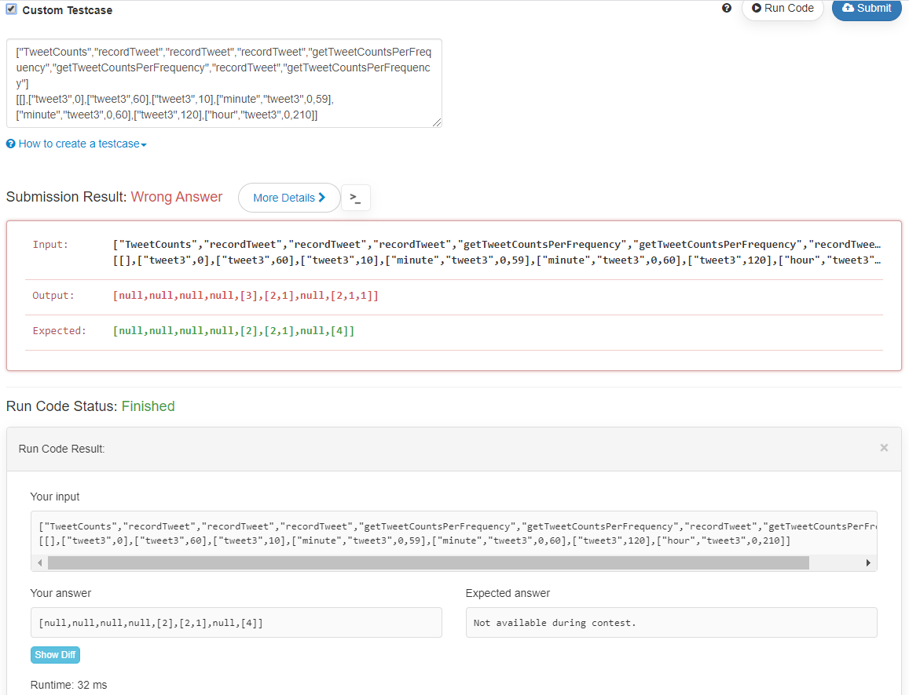

# leetcodes
Share my solutions, feel free to leave any comment by posting "Issues"

# [weekly-contest-182](https://leetcode.com/contest/weekly-contest-182)

<span id="Q1395"></span>
# 1395. Count Number of Teams
The size of the original problem is very small so that even the brute force approach can pass all the test cases. However, to help preparing for job interviews, I'll introduce three different methods that has different time complexities.

## Approach 1: Brute force

The brute force approach is straight forward, we go through each index of `i`, `j`, `k`, and see if they meet the requirement.

``` Python
class Solution:
    def numTeams(self, rating: List[int]) -> int:
        n = len(rating)
        if n <= 2:
            return 0
        ans = 0
        for i in range(n):
            for j in range(i):
                for k in range(j):
                    if rating[i] > rating[j] and rating[j] > rating[k]:
                        ans += 1
                    elif rating[i] < rating[j] and rating[j] < rating[k]:
                        ans += 1
        return ans
```

### Complexity Analysis:
* Time complexity : O(n^3). There are three for loops so the time complexity is O(n^3).
* Space complexity : O(1).

## Approach 2: Brute force with preprocessing
For each soldier in the middle of the team, the number of teams for him is the `larger_ratings_to_the_left` * `smaller_ratings_to_the_right` + `smaller_ratings_to_the_left` * `larger_rating_to_the_right`. We can preprocess these values in advance to save time.


``` Python
class Solution:
    def numTeams(self, rating: List[int]) -> int:
        n = len(rating)
        if n <= 2:
            return 0
            
        larger_ratings_to_the_left = [0] * n
        larger_ratings_to_the_right =  [0] * n
        smaller_ratings_to_the_left = [0] * n
        smaller_ratings_to_the_right = [0] * n
        
        # preprocessing
        for i in range(n):
            rating_i = rating[i]
            for j in range(i): # from left to right
                if rating[j] > rating_i:
                    larger_ratings_to_the_left[i] += 1
                elif rating[j] < rating_i:
                    smaller_ratings_to_the_left[i] += 1                    
            for j in range(n-1, i, -1): # from right to left
                if rating[j] > rating_i:
                    larger_ratings_to_the_right[i] += 1
                elif rating[j] < rating_i:
                    smaller_ratings_to_the_right[i] += 1
               
        # go through each soldier as the middle of the team
        ans = 0
        for i in range(1, n-1):
            ans += larger_ratings_to_the_left[i] * smaller_ratings_to_the_right[i]
            ans += smaller_ratings_to_the_left[i] * larger_ratings_to_the_right[i]
            
        return ans
```

### Complexity Analysis:
* Time complexity : O(n^2). The time complex for preprocessing is O(n^2), the time complex for final processing is O(n).
* Space complexity : O(n). We use 4 extra lists to record the preprocessed results.


## Approach 3: Preprocessing with Binary Indexed Tree
The bottleneck now is the preprocessing, can we accelerate it? The answer is YES, by using a data structure called Binary Indexed Tree. Binary Indexed Tree is a data structure that can calculate the prefix sum of a list of numbers in O(log n) and the update of any number also takes O(log n). More details can be found [here](https://www.geeksforgeeks.org/binary-indexed-tree-or-fenwick-tree-2/).
Since `1 <= rating[i] <= 10^5`, we can build a binary indexed tree `BIT` of size 10^5, `BIT.values(i)` represents the number of ratings that equal to i. `BIT.prefix(i-1)` is the number of ratings that smaller than i. `BIT.prefix(10^5) - BIT.prefix(i)` is the number of ratings that larger than i.

``` Python
class BinaryIndexedTree:
    def __init__(self, maxsize):
        self.maxsize = maxsize
        self.values = [0] * (maxsize+1)
    def add(self, index, value):
        ''' 1 <= index <= maxsize '''
        while(index<=self.maxsize):
            self.values[index]+=value
            index += index & (-index)
    def prefix(self, index):
        ''' 1 <= index <= maxsize '''
        res = 0
        while(index>0):
            res += self.values[index]
            index -= index & (-index)
        return res

class Solution:
    def numTeams(self, rating: List[int]) -> int:
        maxRating = max(rating) # <= 10 ** 5
        n = len(rating)
        if n <= 2:
            return 0
            
        larger_ratings_to_the_left = [0] * n
        larger_ratings_to_the_right =  [0] * n
        smaller_ratings_to_the_left = [0] * n
        smaller_ratings_to_the_right = [0] * n
        # preprocessing
        BIT = BinaryIndexedTree(maxRating)   # from left to right
        for i in range(n):
            rating_i = rating[i]
            smaller_ratings_to_the_left[i] = BIT.prefix(rating_i-1)
            larger_ratings_to_the_left[i] = BIT.prefix(maxRating) - BIT.prefix(rating_i)
            BIT.add(rating_i, 1)        
        BIT = BinaryIndexedTree(maxRating) # from right to left
        for i in range(n-1, -1, -1):
            rating_i = rating[i]
            smaller_ratings_to_the_right[i] = BIT.prefix(rating_i-1)
            larger_ratings_to_the_right[i] = BIT.prefix(maxRating) - BIT.prefix(rating_i)
            BIT.add(rating_i, 1)    
               
        # go through each soldier as the middle of the team
        ans = 0
        for i in range(1, n-1):
            ans += larger_ratings_to_the_left[i] * smaller_ratings_to_the_right[i]
            ans += smaller_ratings_to_the_left[i] * larger_ratings_to_the_right[i]
            
        return ans
```
 
### Complexity Analysis:
* Time complexity : O(n log maxRating). The time complex for preprocessing is O(n log maxRating), the time complex for final processing is still O(n).
* Space complexity : O(n+maxRating). The space complexity for the BinaryIndexedTree is O(maxRating).

# 1396. Design Underground System
use two HashMap (stationA, stationB) -> int to record the total time from and how many times of this transportation we have. <br>
use one HashMap customerID -> (station, time) to record each customer that has checked in but not checked out. <br>

# 1397. Find All Good Strings
DP[i][j][g][h] is the number of strings with length i
* the suffix's longest match is evil[:j]
* g is True means the strings are equal to s1[:i]
* h is True means the strings are equal to s2[:i]

Corner Casees: only DP[0][0][1][1] = 1
```
get_new_j = [[0]*26 for i in range(len(evil))] 
# get_new_j[i][c] is the length of longest suffix of evil[:i]+chr(c+'a') that matches evil
foreach (i,c): # you can use KMP for better speed but brute force O(N^2) is enough because len(evil)<=50
    string = evil[:i] + chr(c+ord('a'))
    for length in range(i+1, 0, -1):
        if string.endswith(evil[:length]):
            get_new_j[i][c]=length
            break
foreach (i,j,g,h), for new_char from 'a' to 'z':
    if g and new_char < s1[i] or h and new_char > s2[i]: continue
    new_g = int(g and new_char == s1[i])
    new_h = int(h and new_char == s2[i])
    if new_char == evil[j] and j < K-1:
        DP[i+1][j+1][new_g][new_h]+=DP[i][j][g][h]
    elif new_char != evil[j]:
        new_j = get_new_j[j][c]
        DP[i+1][new_j][new_g][new_h]+=DP[i][j][g][h]
```

# [weekly-contest-181](https://leetcode.com/contest/weekly-contest-181)

# 1390. Four Divisors
Method 1: preprocess all prime numbers below 1e5, for each `number`, just go through every prime, once we find one `divisor`, we calculate the `remainder` there are three possibilities:
1. the `remainder` is a prime and different from `divisor`
2. the `remainder` is `divisor * divisor`
3. any other cases

Only in the first two cases, this `number` has exactually four divisors.

# 1391. Check if There is a Valid Path in a Grid
dfs

# 1392. Longest Happy Prefix
Rolling Hash method. Let's start with the brute force method: there are `n-1` prefix and comparing two strings of length `m` takes `O(m)`, so the brute force method takes `O(n^2)`. Can we do anything to make the string compare faster? By using rolling hash, we treat each string as a base-26 number mod a very big prime number `MOD` (like 1e9+7) and we can calculate the hash value for each prefix in O(1) using the previous prefix, here is an example for "ababab":
1. prefix1: 'a', hash = 0, suffix1: 'b', hash = 1
2. prefix2: '**a**b', hash = (**0** * 26 + 1)%MOD = 1, suffix2: 'a**b**', hash = (0*(26\**1%MOD)+**1**)%MOD = 1
3. prefix3: '**ab**a', hash = (**1** * 26 + 0)%MOD = 26, suffix3: 'b**ab**', hash = (1*(26\**2%MOD)+**1**)%MOD = 677
4. prefix4: '**aba**b', hash = (**26** * 26 + 1)%MOD = 677, suffix4: 'a**bab**',  hash = (0*(26\**3%MOD)+**667**)%MOD = 677
5. prefix5: '**abab**a', hash = (**677** * 26 + 0)%MOD = 17602, suffix5: 'b**abab**', hash = (1*(26\**4%MOD)+**677**)%MOD = 457653
(to calculate new hash value in `O(1)`, we also need to keep track of `26**k%MOD`)<br>

The hash value for prefix and suffix with length 2 and 4 are the same, so the longest happy prefix is prefix4.


# [weekly-contest-180](https://leetcode.com/contest/weekly-contest-180)

### 5357. Design a Stack With Increment Operation
Since the `k` and `n(the number of calls`) is very small, a list with O(kn) increment will pass.

### 5179. Balance a Binary Search Tree
Use a `dfs` to get all the value, and make the tree using divide-and-conquer. 

### 5359. Maximum Performance of a Team
Sort all the people to have decreased `efficiency`. Go through the sorted people list and maintain a heap (priority queue) to have at most K people with largest `speed`, also maintain the sum of that heap. Update the answer with `max(ans, heap_sum * current_efficiency)`. 

### [weekly-contest-179](https://leetcode.com/contest/weekly-contest-179)

### 5353. Bulb Switcher III
for the `Kth` turn, record the max index of Bulb that has been turned on, if the max index is the same as `K`, increase the answer by 1.

### 5354. Time Needed to Inform All Employees
build the tree in an HashMap as {head:[kid1, kid2...]} and do a dfs.

### 5355. Frog Position After T Seconds
It's like a DP on the tree. <br>
Maintain a list of possible nodes: [(node1, possibility1), (node2, possibility2)...]. This list is initialized as [(1, 1.0)] <br>
For each turn, we go through all possible nodes: `node_i`, `possibility_i`:
1. if that node has no child nodes, add `(node_i, possibility_i)` to the list for the next turn
2. if that node has `k` child nodes, for each child, add `(child_j, possibility_i / k)` to the list for next turn
In the end, check if our target is in the list, if yes, return the possibility, if no, return 0.0


### [biweekly-contest-21](https://leetcode.com/contest/biweekly-contest-21)

### 1370. Increasing Decreasing String
The best solution is to count all the characters and put all `(character, count)` pairs in a double linked list and process the data accordingly. This method takes O(n) time.

### 1371. Find the Longest Substring Containing Vowels in Even Counts
Even this problem is marked as `Medium`, I think this is the most difficult one in this contest. <br>
The solution is similar to [two sum](https://leetcode.com/problems/two-sum/). The only difference is that we don't use the HashMap to store the prefix sum, but instead we store the status of vowels as a tuple. For example (1,0,0,1,1) means the number of 'a', 'o' and 'u' is odd. For each position in s, if our current status is already in the HashMap, we find a valid substring. <br>
Instead of using tuples, a better solution is to use the binary representation and use xor(`^`in python and c) to update the status.

### 1372. Longest ZigZag Path in a Binary Tree
use `dfs(node)` return a tuple `(left, right)` which means the longest length if the next node is `node.left` or `node.right` accordingly. Don't forget to update the answer before return because the path doesn't need to start from the root.

### 1373. Maximum Sum BST in Binary Tree
Similar to the last question, use `dfs(node)`, return a tuple `(subsum, min_val, max_val)`, if the subtree is not a BST, the subsum should be `-inf` and we should return `-inf` as the subsum as well. Also, if the `min_val` from `node.right` is less or equal to `node.val` or the `max_val` from `node.left` is greater or equal to `node.val`, we should return `-inf` as subsum. Otherwise, we should first update the answer and return correct `(subsum, min_val, max_val)`.

### [weekly-contest-178](https://leetcode.com/contest/weekly-contest-178)

### 5345. Rank Teams by Votes
for each candidate, create an array means the votes he got for each place, and add his name to the end of the array. <br>
negative the votes and then sort the arrays. we cannnot simple use `reverse=True` because when two candidates have the same votes, we want to rank them alphabetically.

### 5346. Linked List in Binary Tree
use `dfs(head, root, flag=0)`, the flag means whether the matching has begun.

### 5347. Minimum Cost to Make at Least One Valid Path in a Grid
very interesting puzzle. I use something similar to a `bfs` but use a priority queue(heap) instead of queue. The item in the priority queue is `(cost, x, y)`. for each location, I put the next target with the same cost into the queue and also its adjacent locations with `cost+1` into the queue. I also use a `visited` hashset to record locations I have already visited. <br>
__Update__: We don't need a heap, a deque is enough: we put next target to the top and put the adjacent ones to the botton.

### [weekly-contest-177](https://leetcode.com/contest/weekly-contest-177)

### 5169. Number of Days Between Two Dates
use `mktime(time.strptime(date1, '%Y-%m-%d'))` to get timestamp in seconds

### 5170. Validate Binary Tree Nodes
return true if and only if this tree meets the following two requirements:
1. only one root (not occur in child list)
2. there are `n+1` -1

### 5171. Closest Divisors
go though (int(sqrt(num)), 0, -1) to find out closest divisors for num+1 and num+2 <br>
Since n <= 1e9, this O(sqrt(n)) algorithm is fast enough.

### 5172. Largest Multiple of Three
1. sort the list descendingly.
2. if the sum can be devided by 3, `return ''.join(str(i) for i in digits)`
3. if the remainder is 1, we first search from right to left and try to remove one element that also has 1 as remainder 
4. if there is no such element, we try to remove two elements which both have 2 as remainder
5. if the remainder is 2, do similar things as step 3 and 4.

### [biweekly-contest-20](https://leetcode.com/contest/biweekly-contest-20)

### 1358. Number of Substrings Containing All Three Characters
Use two pointers, `p1` is the beginning of our substring and `p2` is the leftmost position to make sure s[p1:p2] contains all three characters. <br>
We also need a `Counter` to record how many 'a','b' and 'c's between our two pointers. <br>
For each starting point `p1`, the number of qualified substring is `n-p2+1` <br>
Both `p1` and `p2` can only move rightward, so there is only O(n) moves and the time complexity is also O(n). <br>
`Counter` has at most 3 items, so the space comlexity is O(1). 

### 1359. Count All Valid Pickup and Delivery Options
Let's insert delivery between pickups one by one.
```
dp[i][j] means number of options if we put the jth Delivery behind the ith Pickup
dp[i][0] = (n!) * (i+1) # (n!) is the ordering for all Pickups, (i+1) is the number of pickups before this delivery
dp[i][j] = 0 if j > i else (
           sum(dp[j-1..i][j-1]) * (i+1-j) )# (i+1-j) is the number of pickups that has not been delivered
return dp[n-1][n-1]
```
When using running sum, the time complexity is O(n^2), when using rolling array, the space complexity is O(n).

### [weekly-contest-176](https://leetcode.com/contest/weekly-contest-176)

### 1352. Product of the Last K Numbers
```
class ProductOfNumbers:
    def __init__(self):
        self.pow = [1] # power from beginning if we replease every 0 to 1
        self.last_zero = -1 # index for last zero
        
    def add(self, num: int) -> None:
        if num == 0:
            self.last_zero = len(self.pow)
            self.pow.append(1)
        else:
            self.pow.append(self.pow[-1]*num)
            
    def getProduct(self, k: int) -> int:
        N = len(self.pow)
        return 0 if p2 < self.last_zero else self.pow[N-1]//self.pow[N-1-k]
```

### 1353. Maximum Number of Events That Can Be Attended
use a heap to record all opened events order by their ending day, and chose the one that ends first

### 1354. Construct Target Array With Multiple Sums
starting from the target, reverse the process and see if we can get [1]*N <br>
1. you can use a running sum to prevent calculating the sum for every step
2. you can use a heap to find out the max value in each step


### [weekly-contest-175](https://leetcode.com/contest/weekly-contest-175)

### 5333. Minimum Number of Steps to Make Two Strings Anagram
Count sum1 of the difference of every char that occurs more in S than T. <br>
Count sum2 of the difference of every char that occurs more in T than S. <br>
Return max(sum1, sum2) # actually I guess they are the same

### 5334. Tweet Counts Per Frequency
I keep getting this: when I 'run' or 'submit' the code, the output is different.


### 5334. Tweet Counts Per Frequency
We call it '状态压缩dp' in Chinese, maybe 'status dynamic programming' in English? <br>
The time complexity is O(m*(2^n)*(2^n)), space is O(m*(2^n)) or O(2^n) when using rolling matrix <br>
The idea is to treat students in each line as a binary number, for example: '..##.' is 0x19 which is 25.
All possible status are [0, 2^n). <br>
First we need an array called `one_count[status]` representing how many '1' (or students) in that status, `one_count[i]=one_count[i-(i&-i)]+1` <br>
Next we need an array called `seat_status[0..m-1]` represent the status of seats <br>
Then we can calculate our `dp[i][status]` meaning the max number of student if the student of ith row is in `status`  in the following steps:
1. we need to check the status is valid: `(status | seat_status[i])^seat_status[i]==0`
2. enumerate all the status in last row, and find max status that meat the requirement: (status2<<1)&status==0 and (status2>>1)&status==0:
3. dp[i][status]=dp[i-1][status2]+one_count[status]


return max(dp[-1])

### [biweekly-contest-19](https://leetcode.com/contest/biweekly-contest-19)

### 1343. Number of Sub-arrays of Size K and Average Greater than or Equal to Threshold
Here, the sub-arrays means sub-seqences, so there are only `N-K+1` sub-sequences, you can calculate the sum(average) for each of them using a sliding window method.

### 1344. Angle Between Hands of a Clock
the angle for minutes is: `minutes / 60.0 * 360` <br>
the angle for hour is: `hour / 12.0 * 360 + minutes / 60 * 360 / 12` <br>
the output is `abs(ang_minutes-ang_hour) if abs(ang_minutes-ang_hour) <= 180 else 360-abs(ang_minutes-ang_hour)`

### 1345. Jump Game IV
We can use BFS to slove this question:
1. We use an `queue`(collections.deque) to store every index to be explored. Besides the index, we also need to store how many steps we have alread spent to jump there.
2. We also need a `HashSet`(set) to check if any index has been explored or not, and add the index to this HashSet the same time when we add that index to the queue (not the time when we actually explorer it).
3. We also need a `HashMap{value: list of index}`(dict), so we know which indexes we can jump to. And we need to delete the whole list the first time when we visit any index in this list, because we are doing bfs and there is not shorter way to explorer these indexes.


### [weekly-contest-173](https://leetcode.com/contest/weekly-contest-173)

### 5320. Filter Restaurants by Vegan-Friendly, Price and Distance
```sort(key=lambda x:(-x[1], -x[0]))```
### 5321. Find the City With the Smallest Number of Neighbors at a Threshold Distance
[Floyd–Warshall algorithm](https://en.wikipedia.org/wiki/Floyd%E2%80%93Warshall_algorithm)
### 5322. Minimum Difficulty of a Job Schedule
`DP[m][n]` means minimum difficulty to finish first m jobs in n days <br>
`DP[i][n] = min(dp[k][n-1]+maxrange[k+1][i] for k in range(n-1, i))` <br>
`maxrange[i][j]` means the max value from i to j<br>
`maxrange[i][i+step]=max(maxrange[i][i+step-1], jobDifficulty[i+step])`

### [biweekly-contest-18](https://leetcode.com/contest/biweekly-contest-18)

### 1330. Reverse Subarray To Maximize Array Value
If we reverse `nums[i..j]`, the new value only depends on `nums[i-1]`, `nums[i]`, `nums[j]` and `nums[j+1]`. <br>
only when the interval `nums[i-1]..nums[i]` doesn't have overlap with `nums[j]..nums[j+1]`, the value will increase. <br>
if min(`nums[i-1]`,`nums[i]`)>max(`nums[j]`,`nums[j+1]`), the increasement is 2*(min(`nums[i-1]`,`nums[i]`)-max(`nums[j]`,`nums[j+1]`)) <br>
elif max(`nums[i-1]`,`nums[i]`)<min(`nums[j]`,`nums[j+1]`), the increasement is 2*(min(`nums[j]`,`nums[j+1]`)- max(`nums[i-1]`,`nums[i]`)) <br>
so, to find out best `j` for each `i` on O(1), we can use two arrays: <br>
1. maxright[i]=max(min(nums[j],nums[j+1]) for j in range(i+1, N-1))
2. minright[i]=min(max(nums[j],nums[j+1]) for j in range(i+1, N-1))

These two arrays can be preprocessed in O(n) using DP, so we can solve the problem in O(n). <br>
PS: don't forget to test two special cases: reverse `nums[0..i]` and reverse `nums[i..N-1]`


### [weekly-contest-172](https://leetcode.com/contest/weekly-contest-172)

### 5316. Print Words Vertically
Use a 2D array, don't forget to `.rstrip()` before returning the result.

### 5317. Delete Leaves With a Given Value
`dfs(node, target)`, return True if the parent of `node` should delete this node.

### 5318. Minimum Number of Taps to Open to Water a Garden
preprocess all the intervals and sort them by the right end. <br>
Maintain a stack to record the __valid  left end__ and the right end of all selected intervals. __valid left end__ is max(`the right end of last selected interval`, `current left end`). <br>
Go through all the sorted intervals. First, we pop out all intervals at the top of the stack if its __valid left end__ is larger or equal to the left end of current interval. Then add this interval to the stack. <br>
Go through the stack and check if any point is not being covered. <br>
Each interval can be add to or popped out at most once, so the time complexity is O(nlogn).


### [weekly-contest-171](https://leetcode.com/contest/weekly-contest-171)

### 5308. Minimum Flips to Make a OR b Equal to c
For the i-th bit, if c[i]==0, we need a[i]+b[i] flips; if c[i]==1, we need 1^(a[i]|b[i]) flips

### 5309. Number of Operations to Make Network Connected
If the connections are more or equal to n-1, then it's always possible. <br>
If possible, the `number of operations` equals to the `number of connected components` - 1. We can use [union-find](https://en.wikipedia.org/wiki/Disjoint-set_data_structure) to find out the number of connected components.

### 5310. Minimum Distance to Type a Word Using Two Fingers
DP[i][j] means the minimum cost when we finish the first `i` input with the other finger on `j`.<br>
```
DP[0][j] = 0
DP[i][j] = DP[i-1][j] if word[i-1]==word[i] 
         = min(DP[i-1][k]+dis(k, word[i]) if word[i-1]==j 
         = DP[i-1][j] + dis(word[i-1], word[i])
```
return min(DP[-1])

### [biweekly-contest-17](https://leetcode.com/contest/biweekly-contest-17)

### 5144. Matrix Block Sum
use 2D prefix sum matrix

### 5145. Sum of Nodes with Even-Valued Grandparent
`dfs(root, p1, p2):`

### 5146. Distinct Echo Substrings
~~Enumerate the length of smaller substring from 1 to len(text)//2. For each given length `l`, we try to match `text[i]` with `text[i+l]`, use a variable `count` to record the number of matched characters to the left of `i`. When `count` >= `l`, we find a new qualified substring and add that to a hashset.~~
Although the above solution did pass the contest, but it's actually O(N^3) because adding a string to a hashset takes O(N). To reduce the time complexity, we need to use rolling hash like [this](https://leetcode.com/problems/distinct-echo-substrings/discuss/477060/Accepted-O(n2)-rolling-hash-solution). 

### [weekly-contest-170](https://leetcode.com/contest/weekly-contest-170)

### 5304. XOR Queries of a Subarray
because `x xor x = 0` and `0 xor x = x xor 0 = x`, we can use `prefix_xor[i]` to represent `arr[0] xor arr[1] xor ... arr[i]`, and get `arr[i] xor ... arr[j]` by `prefix_xor[i-1] xor prefix_xor[j]`

### 5305. Get Watched Videos by Your Friends
use bfs to findout level k friends and use a collections.Counter to record the frequency.

### 5306. Minimum Insertion Steps to Make a String Palindrome
___for problems about palindrome, there are usually two methods: 1. find a center and do it outward 2. find the boundary and do it inward___ <br>
`dp(i,j)` means the minimal steps to make `s[i:j+1]` a palindrome <br>
`dp(i,j) = dp(i+1,j-1) if s[i]==s[j] else min(dp(i+1,j),dp(i,j+1))+1`

### [weekly-contest-169](https://leetcode.com/contest/weekly-contest-169)

### 1305. All Elements in Two Binary Search Trees
the tree is very small, you can get all values using dfs and return the sorted list. 
### 1306. Jump Game III
bfs.
### 1307. Verbal Arithmetic Puzzle
a very complicated dfs: <br>
`dfs(col, row, acc, assigned, digits)` means the column index(from right to left), the row index, accumulated sum for current column, a hashmap from character to digits and a hashset of the remaining digits. <br>
return `dfs(0, 0, 0, {}, set(range(0, 10)))`

### [Biweekly Contest 16](https://leetcode.com/contest/biweekly-contest-16)
### 1300. Sum of Mutated Array Closest to Target
use binary search to find the smallest `value` to make a sum larger than target, compare `value` and `value-1`

### 1302. Deepest Leaves Sum
use dfs which returns two values: (depth, sum)

### 1301. Number of Paths with Max Score
DP with two matrixes: `maxsum` and `number_of_paths`

### [weekly-contest-167](https://leetcode.com/contest/weekly-contest-167)

### 1291. Sequential Digits
enumerate through 1-9 as the beginning digit, extend the digit until it ends with 9, put all qualified digits into a list and return the sorted list at last.

### 1292. Maximum Side Length of a Square with Sum Less than or Equal to Threshold
same as [1277](#Q1277).solution.1. The time complexity is O(nm^2*log(m,n)). <br>
Solutions of O(MN) can be found [here](https://leetcode.com/problems/maximum-side-length-of-a-square-with-sum-less-than-or-equal-to-threshold/discuss/451909/C%2B%2B-Two-O(MN)-Solutions.-PrefixSum-%2B-SlidingWindow-or-PrefixSum-%2B-Smart-Enumeration).

### 1293. Shortest Path in a Grid with Obstacles Elimination
A special bfs. Use a hashmap to record the smallest number of passed obstacles for each coordinate. Add the target coordinate to the queue only if the number can be reduced.

### [biweekly-contest-15](https://leetcode.com/contest/biweekly-contest-15)
### 1288. Remove Covered Intervals
sort intervals by `key=lambda x:(x[0], -x[1])`, iterate through sorted intervals, if `b` for the new interval is smaller or equal than the last one, it's already been covered, otherwise, it will never be covered by any other intervals.

### 1286. Iterator for Combination
use `itertools.combinations`. To implement `hasNext`, we can prefetch a value using `self.nextV = next(self.iter, None)`.
Here is an explanation of itertools: [stackoverflow](https://stackoverflow.com/questions/24907913/explain-combination-function-of-python-module-itertools)

### 1289. Minimum Falling Path Sum II
Let DP[i][j] represents the minimum if we chose arr[i][j]. 
* Method0: DP[i][j] = min(min(DP[i-1][:j]), min(DP[i-1][j+1:]) + arr[i][j]. Time: O(N^3)
* Method1: use leftmin[i][j] represents min(DP[i][:j+1]) and rightmin[i][j] = min(DP[i][j:], we can optimize the time cost to O(N^2)
* Method2(not necessary): use Rolling Array to optimize the space cost to O(N)


### [weekly-contest-166](https://leetcode.com/contest/weekly-contest-166)

### 1282. Group the People Given the Group Size They Belong To
use a hashMap to store the unfinished groups of each group size.

### 1283. Find the Smallest Divisor Given a Threshold
binary search, look for the range: (L, R], L is not included and R is included.

### 1284. Minimum Number of Flips to Convert Binary Matrix to Zero Matrix
bfs, use ```tuple(map(tuple, mat))``` to make a 2D-list into a hashable tuple.

### [weekly contest 165](https://leetcode.com/contest/weekly-contest-165)

### 1276. Number of Burgers with No Waste of Ingredients
```
4x + 2 y = a
x + y = b
x, y >= 0
x, y are whole numbers
```
<span id="Q1277"></span>
### 1277. Count Square Submatrices with All Ones
#### solution.1
with 2D prefix sum matrix, we can calculate the sum of any square in O(1) <br>
we can go through each top-left point and find the side length of the biggest square using binary search. <br>
the overall time complexity is O(n^2*log(n))
#### solution.2
DP[i][j] means the length of largest square with (i,j) as the botton-right corner. 
```
DP[i][j] == 0 if matrix[i][j] == 0
l = min(DP[i-1][j], DP[i][j-1]) 
DP[i][j] = l + int(matrix[i-l][j-l]==1)
```
the overall time complexity is O(n^2)

### 1278. Palindrome Partitioning III
DP[st][k] means the minimun changes needed for string starting from st using k partitions <br>
DP[st][k] = nonchanges(s[st:st+i]) + min(DP[st+i][k-1]) for i in range(1, len(s)-st) <br>
using memorized search for this problem


### [Biweekly Contest 14](https://leetcode.com/contest/biweekly-contest-14)

### 1272. Remove Interval
for any two intervals: inter1, inter2, there are 6 possibilities:
1. inter1.y <= inter2.x
2. inter1.x >= inter2.y
3. inter1.x >= inter2.x and inter1.y <= inter2.y
4. inter1.x < inter2.x and inter1.y > inter2.y
5. inter1.x < inter2.x and inter1.y < inter2.y #(and inter1.y > inter2.x)
6. inter1.y > inter2.y and inter1.x > inter2.x #(and inter1.x < inter2.y)

### 1273. Delete Tree Nodes
dfs, preprocess an array `Childs` containing the childs for each node, maintain array `sum_of_nodes` and array `removed`.

### 1274. Number of Ships in a Rectangle
it's like a 2D version of binary search. For each search, if there are ships in the area, 
```
dx = topRight.x - bottomLeft.x
dy = topRight.y - bottomLeft.y
```
there is only 1 ship if dx == dy == 0. If the area is larger than that, we can split this area into four sub-areas and search recursively.


### [Weekly Contest 164](https://leetcode.com/contest/weekly-contest-164)

### 1267. Count Servers that Communicate
preprocess two array: row[M] and column[N] which means the number of PC in that row, scan the grid again, for each server, if there is more than 1 server in corresponding row or column, it's not alone.

### 1268. Search Suggestions System
sort the products array, for each prefix of the searchWord, use bisect.bisect_left to find the smallest lexicographically succeeding products, check if the first three of them meet the requirement.

### 1269. Number of Ways to Stay in the Same Place After Some Steps
Very straight forward DP problem. DP[steps+1][i]=DP[steps][i-1]+DP[steps][i]+DP[steps][i+1] (we can use two 1-D array for this). Also, because we have no more than 500 steps, arrLen larger than 500 can be treated as 500.

## [Biweekly Contest 13](https://leetcode.com/contest/biweekly-contest-13)

### 1256.Encode Number
In the new encoding method, '0'*N encodes number (2^0+2^1+..2^(N-1)). So for each number, we can calculate the largest N that represent a number smaller or equal to what we want. N is also the length of final result, we can use standard binary representation to find out the remaining part of the string.

### 1257.Smallest Common Region
It's a [Lowest Common Ancestor(LCA)](https://en.wikipedia.org/wiki/Lowest_common_ancestor) problem. Because there is no update on the tree and has only one query, there is a very simple solution: preprocess the depth of each node, popup the deeper node to the same level as  the other. Popup two nodes simultaneously and because they are at the same level, they will meet each other at their LCA.

### 1258.Synonymous Sentences
Find out all equivalent words using Union-find Sets or just using brute force (because n=10 is very small). Then, do a dfs for each word in the string.

### 1259.Handshakes That Don't Cross
Very straight forward DP: DP[n] means there are n pairs, DP[0] = DP[1]= 1, DP[n]=DP[i]*DP[n-1-i] for i in range(n). 

## [Weekly Contest 162](https://leetcode.com/contest/weekly-contest-162)
### 1253. Reconstruct a 2-Row Binary Matrix
Count the number of 1s and 2s as n1 and n2, if n2 > upper or n2 > lower or n1+2*n2 != upper + lower: impossible <br>
upper -= n2; from left to right, for colsum == 0 or 2, put 1 to none or both rows, if closum==1, if upper > 0: put to upper, upper -=1 else: put to lower

### 1254. Number of Closed Islands
dfs, return false if any part of it is in the border (x==0 or x==n-1 or y==0 or y==m-1), if true, ans+=1

### 1255. Maximum Score Words Formed by Letters
brute force = O(2^words.length * words.length  * words[i].length) ~ 3e6 can pass even if you are using Python


## [Weekly Contest 161](https://leetcode.com/contest/weekly-contest-161)
### 1247. Minimum Swaps to Make Strings Equal
(actually I think this "easy" problem may be the hardest one in this contest lol) <br>
If you have odd number of Xs or Ys, they'll never be splitted equally so return False. <br>
Ignore all those perfect match of XX and YY. Count the remainning Xs and Ys in the first string. (Marked as NumX and NumY) <br>
"XX" or "YY" can be removed in one move, but the last "XY" needs two moves to remove, so the answer is (NumX+NumY)//2+(NumX mod 2)

### 1248. Count Number of Nice Subarrays
The subarray is always continual, so is the k odd numbers. When you chose k odd numbers, you can also chose arbitrary number of even numbers (including 0) in both side of the odd numbers (without chosing another odd number), and the amount is (number_of_even_numbers_to_the_left+1)*(number_of_even_numbers_to_the_right+1).
You can use O(n) to preprocess three helper arrays: 
1. Odds[] # index of odd numbers
2. Left[] # number of even numbers between this odd number and the previous one
3. Right[] # number of even numbers between this odd number and the next one

### 1249. Minimum Remove to Make Valid Parentheses
There is a greedy algorithm for this. Go through the string and maintain a number COUNT which means the number of '(' minus the number of ')'. When ever you find a ')', if COUNT >0, COUNT-=1; if COUNT=0. delete this ')' at once. At last, if COUNT>0, delete '(' from right to left.

### 1250. Check If It Is a Good Array
This one is quite easy if you know [Bézout's identity](https://en.wikipedia.org/wiki/Bézout%27s_identity). Basically, we need to find the GCD for all numbers and that is the minimal positive sum you can get.


## [Biweekly Contest 12](https://leetcode.com/contest/biweekly-contest-12)

### 1244. Design A Leaderboard
Use a dictionary to store score for each id and sort the values when asked by "top(K)". You can use heapq.nlargest but that is still O(nlogn). These are algorithms to find the largest K values with expected O(n) time or even with worest O(n) time, but not necessary here.

### 1245. Tree Diameter
Pick any node as root, DFS trough the tree. For each node, record the depth for all sub-trees, and update the answer if the sum of two deeepest sub-trees is bigger than current answer.

### 1246. Palindrome Removal
DP[i][j] means the smallest moves to remove arr[i:j] (right edge not included)<br>
Init: DP[i][j] = maxint; DP[i][i]=0; DP[i][i+1]=1; DP[i][i+2]=(1 if arr[i]==arr[i+1] else 2)
```
for k in range(3, N+1):
    for i in range(N-k+1):
        end = k + i
        if arr[i]==arr[i+k-1]:
            DP[i][i+k]=DP[i+1][end-1]
        for split in range(1, k):
            DP[i][i+k] = min(DP[i][i+k], DP[i][i+split]+DP[i+split][end])      
```
Due to too many testcases, if you submit using Python, you can easily get TLE. I only passed when using C to implement

## [Weekly Contest 160](https://leetcode.com/contest/weekly-contest-160)
### 1237. Find Positive Integer Solution for a Given Equation
similar to problems solved by two pointers like no.1229
init: x=0,y=1000
if f(x,y)==z: x+=1, y-=1
if f(x,y)>z: y-=1
if f(x,y)<z: x+=1
### 1238
such coding is called [Gray Code](https://leetcode.com/problems/gray-code/)
Gray(n) = Gray(n-1) + [(1<<(n-1))+i for i in reversed(Gray(n-1))]
another solution is that: binaryToGray(n) = n ^ (n >> 1)
### 1239
2\**16=65536<10\**(4.9)<10\**8, so bruce force will not get TLE.
first, filter out strings with charactors appears more than once: 
```
arr=[i for i in arr if len(i)==len(set(i))]
```
second, convert each charactor to a 26-bit int, each bit represents a character: 
```
bits=[sum(1<<(ord(j)-97) for j in i) for i in arr]
```
third: search
```
lengths = [len(i) for i in arr]
res = [(0,0)] # (bitcount, chars)
for length, s in zip(lengths, bits):
    for count, chars in res:
        if chars & s == 0:
            res.append((count+length, chars | s))
res.sort()
return res[-1][0]
```
### 1240. Tiling a Rectangle with the Fewest Squares
complete research: [Filling rectangles with integer-sided squares](http://int-e.eu/~bf3/squares/) <br>
Solutions: 1. Square, 2. Scaling 3. Splitting 4. Basic solutions (special cases) <br>
(11,13) is the only special case when n,m<=13, so a dp solution which only considering rectangle splitting will pass


## [Biweekly Contest 11](https://leetcode.com/contest/biweekly-contest-11)
### 1229. Meeting Scheduler
Two pointers p1 and p2 point at slots1 and slots2 respectively. First calculate the overlapping time period, if not suitable increase p1 or p2 and continue. When ending time from p1 is earlier then p2, increase p1, otherwise increase p2. 
### 1230. Toss Strange Coins
It seems that most probability problems are solved with DP, just like this one. <br>
state: DP[n][h] means when you toss first __n__ coins, the probability of __h__ conins facing head. <br>
transitions: it's not easy to get DP[n][h] when you know DP[n][h-1] but it's easy if you know DP[n-1][h]: <br>
DP[n][h] = DP[n-1][h] * (1-prob[n]) + DP[n-1][h-1] * prob[n] <br>
border elements: DP[0][0]=1, DP[n][0] = DP[n-1][0] * (1-prob[n])
### 1231. Divide Chocolate
binary search the the minimum total sweetness <br>
My habit for binary serach is maintain the range \[left, right), which means that lower-bound inclusive and upper-bound exclusive. the ending criterial is left<right-1
## [Line Sweep](https://leetcode.com/tag/line-sweep/)
### 218. The Skyline Problem
Line sweep from left to right according to keypoints. Maintain a heap according to height and record all visible buildings and their right edge. For each keypoints, first add new visible buildings, then pop all buildings that are no longer visible until the building on the top of the heap is visible. You don't need to remove shorter buildings because they don't influence the result.

### 391. Perfect Rectangle
First try: the range of N is unknown, so I first tried the following O(N^2) method and got a TLE in a testcase with N=11000
the method is 1). renumbering the x-axis and y-axis to 1..N (should I call it Discretization?) 2). fill up an NxN array
todo

### 850. Rectangle Area II
todo
